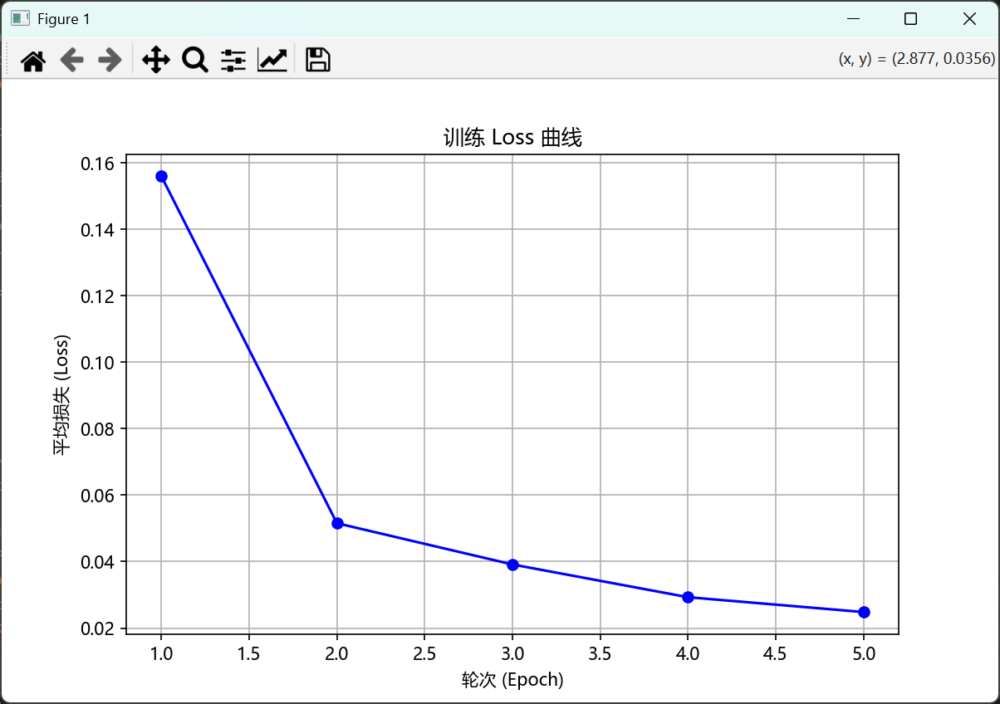

"# mnist-cnn-my-first-dl-project" 
=======

## 我的第一个深度学习项目：MNIST 手写数字识别

## 项目概述
使用 PyTorch 搭建简单 CNN，训练 5 个 epoch，测试准确率达到 99.22%。
使用了anaconda作为环境管理工具。

## 训练结果截图

### Loss 曲线（5 个 epoch，快速收敛）

### 混淆矩阵（对角线极亮，准确率 99%+）

## 环境
- Python 3.11
- PyTorch 2.5.1 + CUDA 12.1
- GPU: RTX 4060 Laptop

## 学习笔记
从环境搭建到模型训练 + 可视化，全程记录。