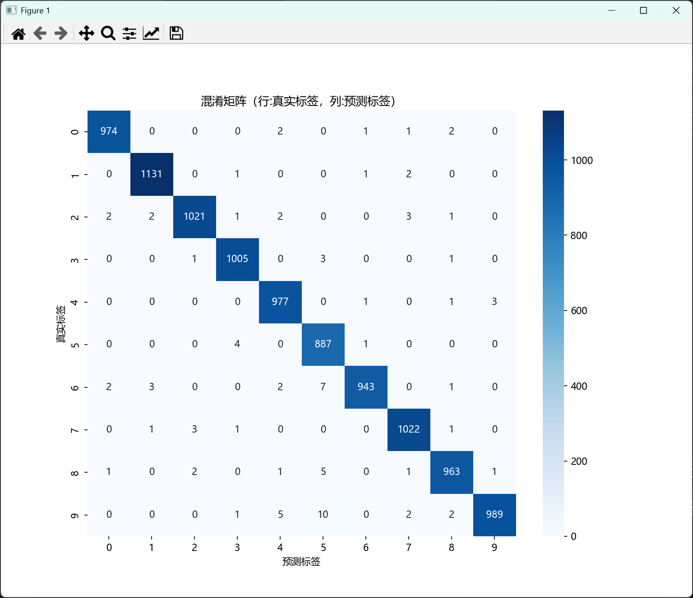
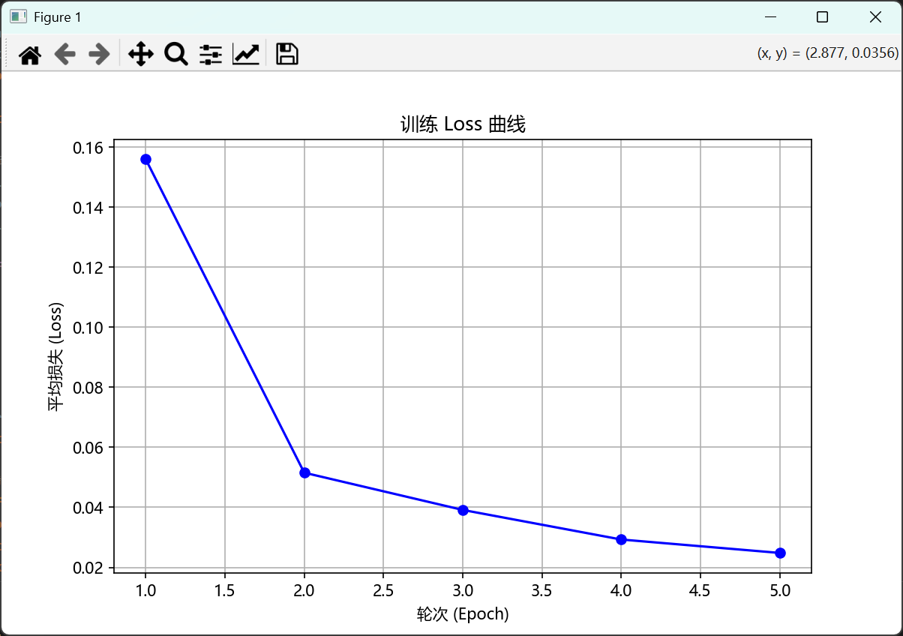

"# mnist-cnn-my-first-dl-project" 
=======

## 我的第一个深度学习项目：MNIST 手写数字识别

## 项目概述
使用 PyTorch 搭建简单 CNN，训练 5 个 epoch，测试准确率达到 99.22%。
使用了anaconda作为环境管理工具。


## 训练结果截图

### Loss 曲线（5 个 epoch，快速收敛）


### 混淆矩阵（对角线极亮，准确率 99%+）


## 环境
- Python 3.11
- PyTorch 2.5.1 + CUDA 12.1
- GPU: RTX 4060 Laptop

## 学习笔记
从环境搭建到模型训练 + 可视化，全程记录。

## 🎯 互动体验 (Web 前端交互)
在此项目中，我们不仅训练了模型，还实现了一个**完全解耦的 Web 交互界面**！
你可以直接在浏览器里手写数字，网页实时通过后端预测数字概率。

### 项目结构
- `mnist_cnn.py`: 模型训练脚本（生成 `model.pth`）
- `inference.py`: 纯推理模块（零网络/网页代码，专心负责模型前向传播）
- `server.py`: Flask 后端 API (提供 `/predict` 接口)
- `static/index.html`: 漂亮精美的纯前台画布 (Vanilla HTML/CSS/JS)

### 如何启动网页？
在有 PyTorch 及 Flask 环境（本例使用 `pytorch_mnist` 这个 Conda 环境）的终端下：
```powershell
python server.py
```
> 如果遇到 OpenMP 冲突，请运行：
> `$env:KMP_DUPLICATE_LIB_OK='TRUE'; python server.py`

然后打开浏览器访问 http://127.0.0.1:5000 即可体验！